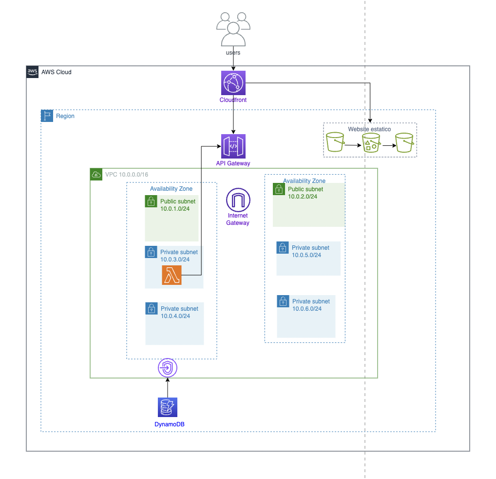

# TP3Cloud - Grupo 5

# Objetivo
El objetivo del trabajo es centralizar el contenido de las diferentes plataformas de Streaming con el fin de que los usuarios puedan identificar rapidamente donde se encuentra el contenido que es de su interés.

# Módulos

Los modulos utilizados son:
- VPC (modulo custom): el modulo VPC crea una VPC con dos AZ. En cada AZ crea una subnet publica y dos subnets privadas. Se crean tambien los security groups, un IGW y VPC endpoints.
- DynamoDB (modulo externo): el modulo de DynamoDB, que crea dos tablas, una para el foro y otra para los usuarios, se implemento con un modulo externo.
- S3 (modulo externo): el modulo de S3 se implemento con un modulo externo. El mismo se utiliza para crear el sitio web estatico. Para ello se crea un bucket para los logs, uno para la web estatica y otro para el www.
- Cloudfront (modulo custom): el modulo de CloudFront se implementó con el fin de poder acceder al sitio web, evitando que cualquiera pueda acceder y además permitiendo cachear el contenido del sitio.
- Lambda (modulo externo): el modulo de Lambda se implemento con un modulo externo. La lambda creada es getCont. Esta dentro de una subnet privada y se conecta al API Gateway para actualizar el contenido (en caso de haber modificaciones en la oferta de las plataformas de streaming). Aunque la logica no esta realizada, se pueden ver las conexiones que la misma implica.  
- API Gateway (modulo custom): Se crea un modulo de API GW, que está conectado a la función Lambda y la gestiona.

# Componentes a evaluar
Los componenetes a evaluar son:
1. VPC
2. DynamoDB
3. S3
4. Cloudfront
5. Lambda
6. API Gateway
7. .....

# Funciones utilizadas
Las funciones utilizadas son:
- length
- filemd5
- fileset
- cidrsubnet
- floor

# Meta argumentos
Los meta argumentos utilizados son:
- Count
- For each
- Lifecycle

# Diagrama de arquitecura
Se arma un diagrama de arquitectura con los componentes deployados
 

